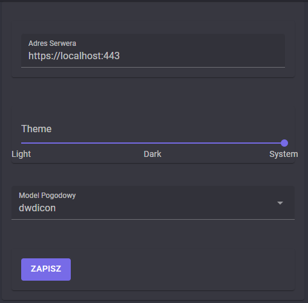

# Settings

Settings are used to configure the behavior of the application. They are stored in local storage in web browsers and in the file system in desktop applications.

## Server Address

The server address is the URL of the server that the application will connect to. The default value is `https://localhost:443`. The server address can be changed by clicking on the input field and typing in the new address. And then clicking on the save button.

## Theme

The theme is used to change the appearance of the application. The default value is `Same as system`. The theme can be changed by moving the slider to the desired value. And then clicking on the save button.

## Forecast Model

The forecast model is used to change the forecast model that the application will use. The default value is 'dwdicon' (Deutscher Wetterdienst ICON model). User can choose between 'emcwf' (European Centre for Medium-Range Weather Forecasts model) and 'dwdicon' (Deutscher Wetterdienst ICON model). The forecast model can be changed by clicking on the input field and choosing the desired value. And then clicking on the save button.
