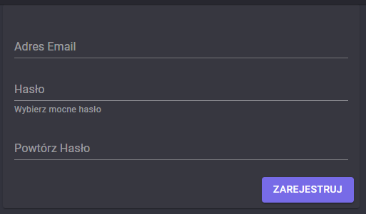
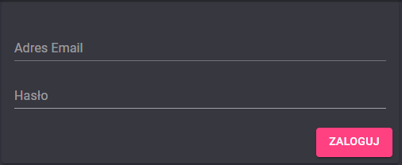
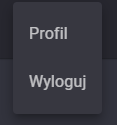
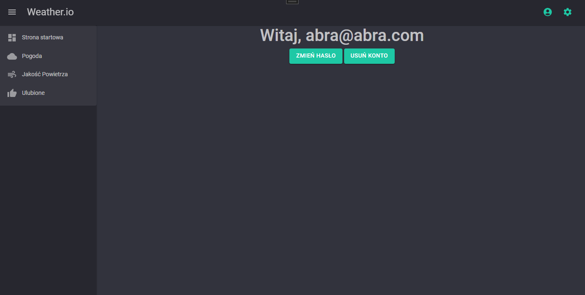
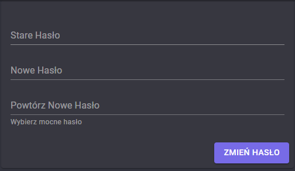

# Authorization

To be able to add places to liked places list, user has to be logged in. To log in, user has to be registered first.

## Registration

To register, user has to provide email and password. Email has to be unique and password has to be at least 8 characters long with at least one uppercase letter, one lowercase letter and one digit.

## Login

To log in, user has to provide email and password. If user is not registered, he/she has to register first. If password is incorrect, user will be notified.

## Logout

To log out, user has to click on account icon in the top right corner and then choose logout option.

## Change password

To change password, user has to click on account icon in the top right corner and then choose profile option.

Then user has to click on change password button and provide old password and new password. New password has to be the same strong password policy as for registration.

If password policy is not met, user will be notified.

## Delete account

To delete account, user has to click on account icon in the top right corner and then choose profile option. Then user has to click on delete account button.

