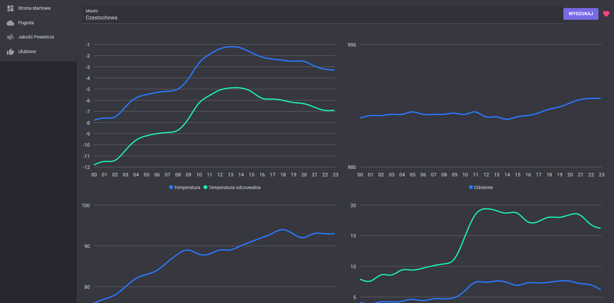
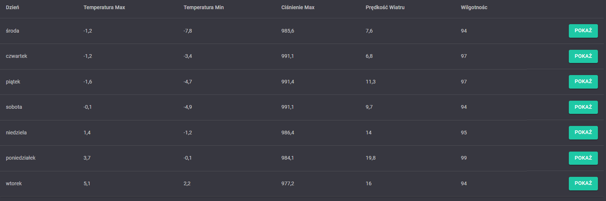

# Weather

## Search

Use the search bar to search for a location. And press enter to search. Forecast for the location will be displayed below.

## Liked

On the right side of the search bar are like button. User can like a location by clicking on the like button (User must be logged in to like a location and first search for a location). Liked locations will be displayed on the liked page.

## Graphs

The weather page is used to display the weather forecast for a specific location. The weather forecast is displayed using four different graphs. The first graph displays the temperature, the second graph displays the preassure, the third graph displays the humidity and the fourth graph displays the wind speed.

## Spcific day

Bellow user can choose to display the weather forecast for specific day by clicking show button.

